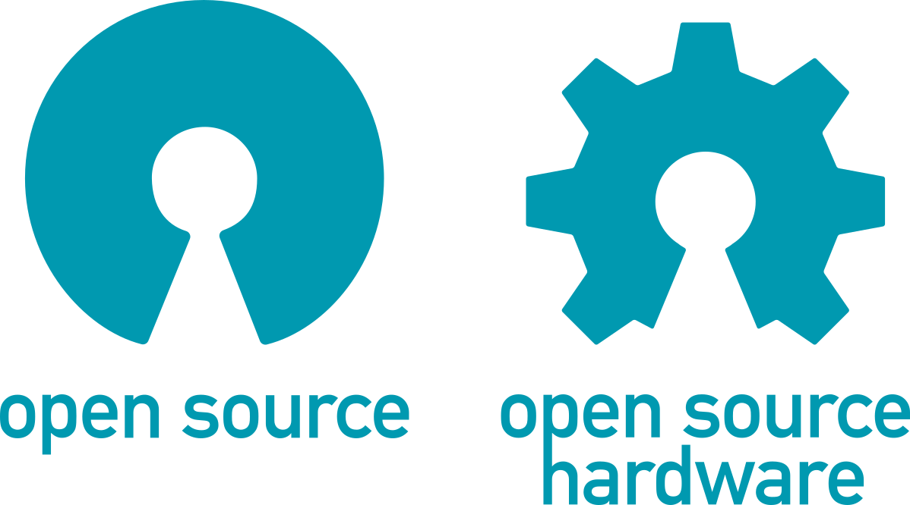

# Electric Saildrive

This repository contains information on how to build and electric saildrive.
This saildrive will be built using standard components.

For information on selected components, check the `components` directory:

```
cooling    => Cooling system
controller => Motor controller
precharge  => Pre-Charge system
throttle   => Throttle
saildrive  => Saildrive leg
propeller  => Propeller
motor      => Electric motor
J1939_N2K  => J1939 CAN and NMEA2000 (N2K)
```

The `VESC` directory contains LispBM code for the VESC Maxim 120 controller's ESP32 and SPM32.
This includes J1939 communication over the CAN bus (to the N2K gateway), pins setup up on the IO expander.

## Status
Motor controller is able to communicate with the gateway (sending out mostly forged data) and replies to the Veratron gateway requests (PGN 0xEA..). ESP32 is able to start power (+12V) on the CAN and NMEA2000 bus, and to read button press events.
There is a button on the FlexBall throttle handle, when pressed the ESP32 can notify the SPM32 (via a CAN message?) and SPM32 could change the throttle response curve, for example.


