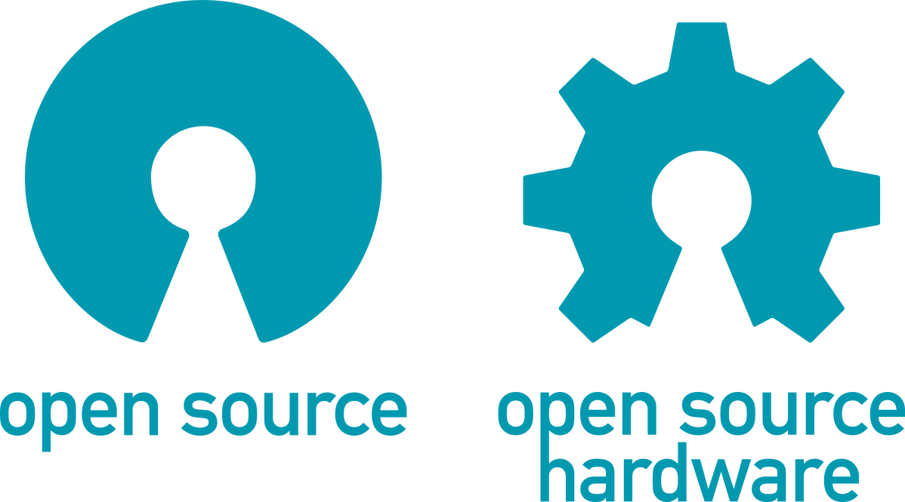

# Electric Saildrive

This repository contains information on how to build and electric saildrive.
This saildrive will be built using standard components.

For information on selected components, check the `components` directory:

```
cooling    => Cooling system
controller => Motor controller
precharge  => Pre-Charge system
throttle   => Throttle
saildrive  => Saildrive leg
propeller  => Propeller
motor      => Electric motor
J1939_N2K  => J1939 CAN and NMEA2000 (N2K)
```

The `VESC` directory contains LispBM code for the VESC Maxim 120 controller's ESP32 and SPM32.
This includes J1939 communication over the CAN bus (to the N2K gateway), pins setup up on the IO expander.

## Status on the CAN side
Motor controller (VESC) is able to communicate with the NMEA gateway sending out the folowing data:
- RPM
- Motor Temp
- VESC Temp
Also, the VESC replies to the Veratron gateway requests (PGN 0xEA..) and send back the running hours.

A CAN exploring tool has been developped (see J1939/explorer) and can be used on linux (using USB/CAN adaptor + socketcan) to inspect/record/replay CAN messages.

## Status on the NMEA200 side

The N2K bus get the information from the gateway (RPM, temperatures, hours) and from the DigitalYacht/Victron SmartShunt (voltage before main relay, voltage after main relay, amps going to the VESC, battery SoC, etc.). All this information is displayed on the GARMIN MFD.

## Powering (+12V) CAN and N2K and button input

VESC's ESP32 is able to start power on (+12V) both CAN and NMEA2000 bus, and to read button press events.
There is a button on the FlexBall throttle handle, when pressed the ESP32 notifies the SPM32 (via a CAN REQUEST message) and SPM32 toggles the maximum input power between momentary max (default) to continuous max ('eco' mode).


