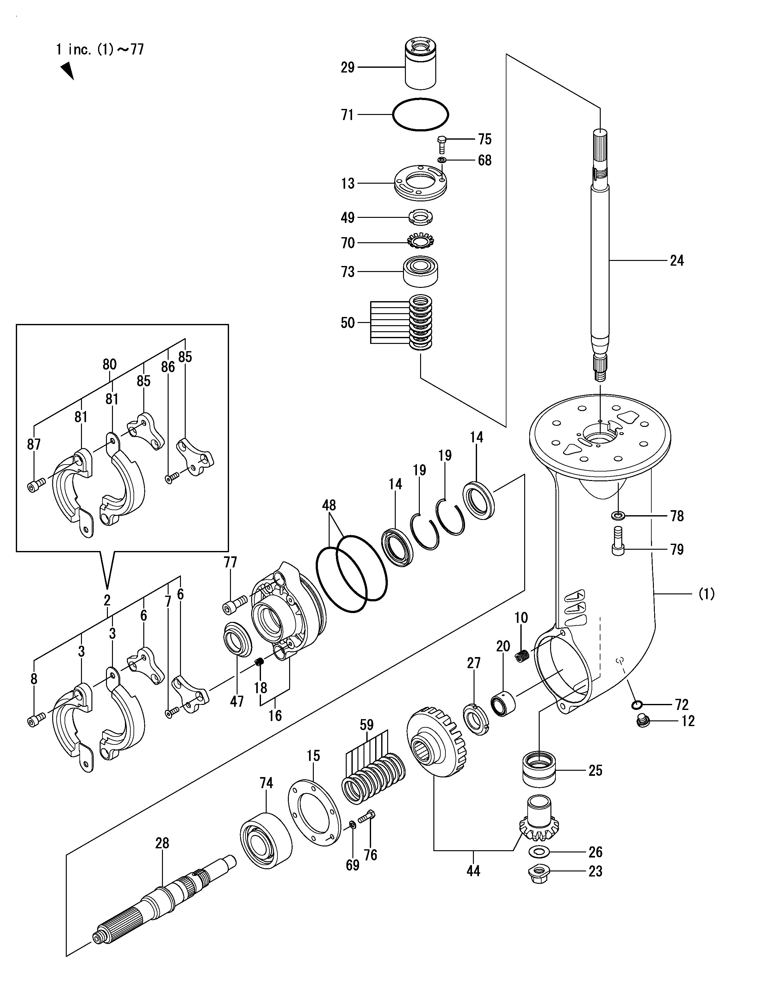

# Saildrive leg

This is the part between the motor and the propeller, sitting befow the hull, in the water.

1. It takes care of reducing the motor speed (2.13:1 ratio)
1. It offers a standard spline for the propeller
1. It keeps the water out...
1. ... and the oil in

The selected saildrive leg (Yanmar SD25) comes with a torque limitor (part 29), placed on top of the input shaft.
This is where the mechanical coupling with the motor is happening.

Note that we only use the lower part of the SD25 saildrive assemble. The top part has the gearbox (Forward/Reverse) for diesel engines - which is not needed..

